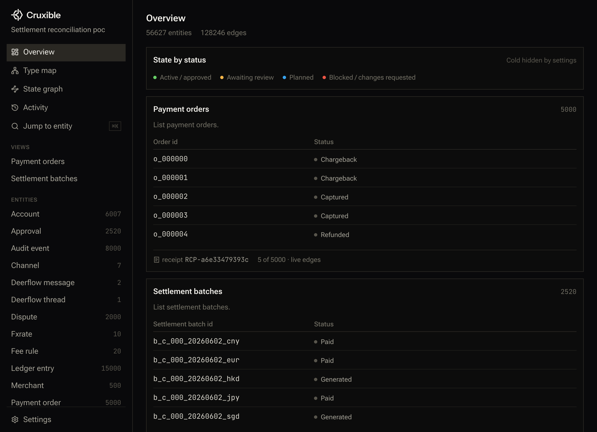
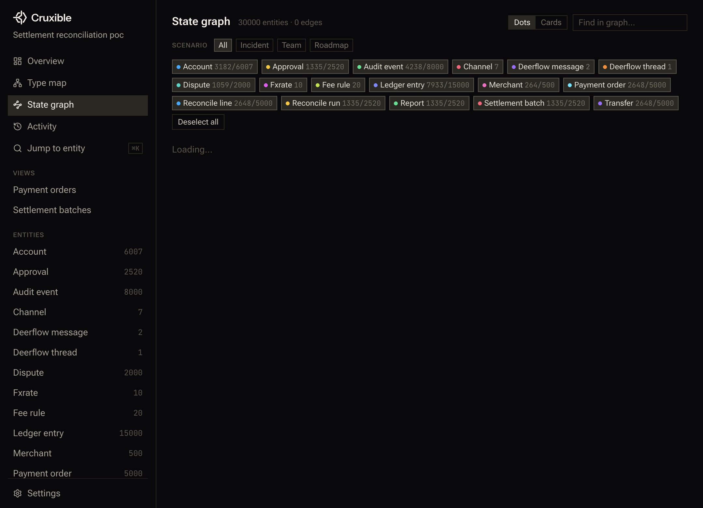
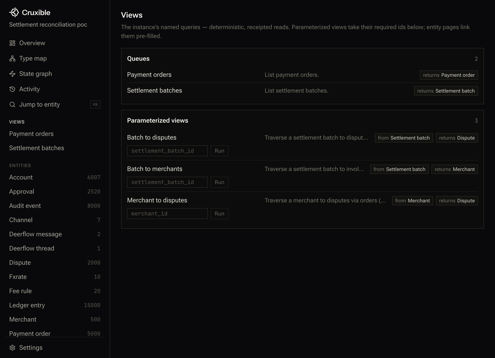
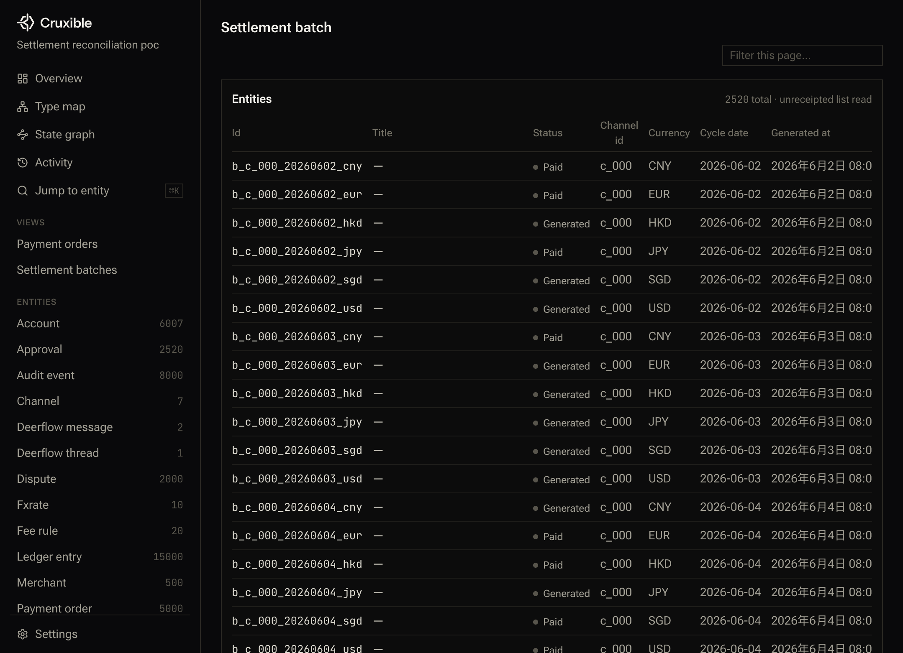

<!-- 图 0：封面主视觉：DeerFlow-By-CC × Cruxible 清结算复杂图谱 POC — 示意图占位（设计待补） -->
> **〔示意图占位｜图 0〕**
> **标题：** 封面主视觉：DeerFlow-By-CC × Cruxible 清结算复杂图谱 POC
> **说明：** 开篇头图：左侧 DeerFlow-By-CC（对话/编排）+ 中间 MCP(SSE) 通路 + 右侧 Cruxible（确定性图谱+receipts+治理），底部「清结算 5.6 万实体 / 12.8 万关系」数据标签。
> **建议类型：** 主视觉/封面拼贴
> **设计要点：**
> - 主色调用两套品牌色叠加：DeerFlow-By-CC 绿系 + Cruxible 蓝系；
> - 中央用一条有向箭头 MCP(SSE) 把左右打通，标注 8100 / 8123 / 2026 / 5174 端口；
> - 右下角叠一张「网络点线」图谱小图，暗示实体关系密度。
> *（设计师可自由发挥版式，内容以本条说明为准。）*


> **图注 0 · 真实 UI 证据**：Cruxible-app Overview Dashboard，直接连上本地 8100 daemon + 清结算 POC 实例（`inst_d9634d5c1e624449`）；左侧 17 类实体按「存在层」分类排布，中间 Dashboard 暴露了命名查询队列、实体类型分布、快照历史三条治理主线。

> 本文适合人群：企业架构师、AI Infra 负责人、支付/清结算/风控系统开发者、对「Agent 如何走出 Demo 进入生产」焦虑的所有工程师。
> 你会得到两样东西：
> 1) 一篇讲透「为什么 Agent 必须搭配本体论/知识图谱才能进入金融级生产」的方法论；
> 2) 一套 DeerFlow-By-CC + Cruxible 的企业级落地实操手册（含 17 类实体、25 类关系、复杂对账链路、可一键复现的清结算 POC 脚本）。

---

# 0. 开篇的灵魂拷问：你的 Agent 到底是「玩具」还是「系统」？

2026 年，绝大多数企业的 Agent 应用都卡在一个极其尴尬的位置：

- **Demo 惊艳，上线即崩**。演示时回答流畅；真接入生产后，面对 ERP、核心交易、财务、风控四套口径不同的系统，Agent 给出的答案像开盲盒。
- **「我觉得对」≠「审计相信对」**。清结算一笔 200 万的差异，Agent 告诉你「大概率是 fee_mismatch」，但 CFO 要的是「证据链」：哪笔订单、哪条费率、哪个汇率、哪条记账分录、谁在什么时候批准过。
- **上下文越长，幻觉越大**。把 10 张报表塞进 context，模型会像实习生一样「挑几条最顺眼的串成一个故事」——最危险的是，**它自己不知道自己在讲故事**。
- **系统多、口径多、名词多**。支付系统说「settlement_batch」是渠道结算批次；财务说「settlement_batch」是入账凭证批次；运营说「settlement_batch」是商户对账单。同一个词，三套语义。

这不是模型参数不够，也不是 prompt 不够细。这是**工程范式的根本错配**：

> 你在用一个「概率生成机」去解决一个「要求确定性、可证明、可追责」的企业问题。

解药不是「把 Agent 做得更聪明」，而是**把它放在正确的位置**：
Agent 负责「意图理解 + 编排 + 创意性工作」，而「事实层、推理层、证据层、治理层」必须交给一个**确定性的决策引擎 + 本体化的知识图谱**。

本文，我们用「清结算/对账/报表/审批/审计」这个**最挑剔的金融场景**，把 DeerFlow-By-CC（Agent 工作流平台）和 Cruxible（确定性决策引擎 + receipts）两个开源项目拼起来，跑通一条完整的企业级链路。

你会亲眼看到：
- 一条 DeerFlow-By-CC 里的自然语言对话，如何变成一张包含 **5.6 万实体、12.8 万关系** 的复杂知识图谱；
- 如何通过本体设计，把「订单 → 转账 → 分录 → 批次 → 对账 → 差异 → 争议 → 报表 → 审批 → 审计」10 个环节的证据链**串成一条可追溯的路径**；
- 为什么 Cruxible 的「receipt（收据）」机制，是 AI + 金融系统结合的关键发明；
- 如何从「POC」走向「企业生产」：多租户、权限分层、版本化、审计、与 ERP/核心/风控系统的四种集成模式。

---

# 一、Agent 在工程领域的 6 大死穴
<!-- 图 1：Agent 工程 6 大死穴 × Cruxible 解法对照矩阵 — 示意图占位（设计待补） -->
> **〔示意图占位｜图 1〕**
> **标题：** Agent 工程 6 大死穴 × Cruxible 解法对照矩阵
> **说明：** 2×6 矩阵：左列「死穴」、右列「Cruxible 解法 + 对应原语/承诺」。强调：这不是 prompt 能解决的问题，而是工程范式的替换。
> **建议类型：** 对照矩阵表/分层图
> **设计要点：**
> - 死穴侧用红色标签（语义对齐缺失 / 推理不可证明 / 治理缺失 / 上下文爆炸 / 系统割裂 / 可复现不足）；
> - 解法侧用蓝色标签，写明「Config / Query+receipt / Permissions / Workflow 批处理 / Ingest+Integrations / Snapshot+lockfile」；
> - 底部一条总括：本体论 4 原语 + 3 层承诺 = 6 死穴一次解。
> *（设计师可自由发挥版式，内容以本条说明为准。）*
（以及为什么本体论是唯一解法）

在正式跑 POC 之前，我们必须先把「问题本质」讲透。否则你花 2 天跑通 POC，第 3 天会卡在「这玩意怎么上线」。

## 1.1 死穴 1：语义对齐缺失——同一个词，三套解释

清结算里最典型的词：「结算批次（settlement_batch）」。

| 系统 | 它说的 settlement_batch 实际上是 |
| --- | --- |
| 渠道收单系统 | 按日/按周打包的渠道清算文件（一个批次 = 一份文件） |
| 资金结算系统 | 给商户出款的执行批次（一个批次 = 一笔打款） |
| 财务总账系统 | 会计期末的汇总过账批次（一个批次 = 一张凭证组） |

Agent 没有本体论时，它怎么做？—— **靠上下文里的高频词猜**。上下文里提「渠道」就按渠道解释；提「出款」就按出款解释。10 次里中 8 次，剩下 2 次「出了事故才知道」。

**本体论怎么解？**
本体不是「画张 ER 图」。本体是**对领域概念的「存在论分类」+「关系约束」+「主键语义」**。在 Cruxible 里，`SettlementBatch` 这个实体类型一旦声明：

```yaml
entity_types:
  SettlementBatch:
    description: "A per-channel per-date reconciliation and settlement envelope containing ledger entries, reports, and reconcile runs."
    properties:
      settlement_batch_id: {type: string, primary_key: true}
      channel_id:          {type: string, indexed: true}
      merchant_id:         {type: string, indexed: true}
      settlement_date:     {type: date}
      currency:            {type: string}
      status:              {type: string}
      total_amount:        {type: float}
```

这就不是「随便一个 dict」了：
- `primary_key` 声明了「什么叫**同一个** batch」（身份条件）；
- `indexed` 声明了「哪些维度需要被批量遍历」；
- `description` 不是给人看的，是给所有工具/Agent 的**语义契约**。

后续所有工具、查询、receipt，都基于这个语义契约运行——**Agent 不用再猜**。

## 1.2 死穴 2：推理不可证明——你怎么证明你说的差异是真的？

传统 Agent 的输出形态是一段话 + 一段代码。问题是：

- 这段代码跑了什么 SQL？JOIN 顺序对吗？
- 它用到的是哪天的快照？会不会有人在你跑完之后改了数据？
- 你说「merchant m_0408 有 1 条差异」，这 1 条是**怎么算出来的**？从 batch 到 line 到 order 走了哪条路径？

Cruxible 的核心发明就是 **receipt（收据）**。每一次查询，除了返回结果，还返回一个 `receipt_id`。通过 `cruxible_receipt` 可以把这次查询的**完整遍历路径、过滤条件、快照版本、命中实体**全部复盘出来。

类比：传统 Agent 是「实习生口头给你一个结论」；Cruxible 是「审计师给你一份工作底稿 + 每一笔的索引定位」。

## 1.3 死穴 3：治理缺失——谁能写、谁能读、谁批过？

企业场景里，「写入」永远比「读取」敏感 100 倍。

你让 Agent 直接写数据库？DBA 先把你抬出去。
你让 Agent 直接写图？合规部门先把项目关停。

Cruxible 的权限不是装饰，而是分 4 层**累积权限**（在 `permissions.py` 里硬编码为工具级门槛，见 [permissions.py:L61-L99](https://github.com/xiaoqianbaobao/cruxible/blob/main/src/cruxible_core/runtime/permissions.py#L61-L99)）：

| 模式 | 能做什么 | 典型角色 |
| --- | --- | --- |
| `READ_ONLY` | query / schema / receipt / evaluate / inspect | 业务分析、审计只读 |
| `GOVERNED_WRITE` | feedback / outcome / group / snapshot / source artifact 注册 | 运营、风控审核员 |
| `GRAPH_WRITE` | add_entity / add_relationship / canonical workflow apply | 图谱工程师、治理 Owner |
| `ADMIN`（默认） | init / ingest / lock / clone / active config replace | 平台管理员 |

这意味着：**你甚至可以把 DeerFlow-By-CC 暴露给实习生或外包**——只要环境变量 `CRUXIBLE_MODE=governed_write`，它想直接改图都改不动，只能走「提案 → 审核 → 批准 → 应用」的治理闭环。

## 1.4 死穴 4：上下文爆炸——100 万订单你塞不进 context，也不该塞

清结算 POC 里真实遇到的问题：
- 用户第一次在 DeerFlow-By-CC 里给的 spec 是 `orders=2,000,000 / merchants=5,000`。
- 如果你把这 200 万订单塞进 context，$100 一次的推理费先不说，模型输出的结果**你根本不敢信**。

正确的工程范式是：
1. Agent 只产出 **spec（规格参数）**：seed、规模、币种、渠道、差异率；
2. 实际数据生成 + 批量写入交给 **Cruxible workflow / 批处理脚本**（确定性、可锁文件、可复现）；
3. Agent 在查询阶段按需取数（paginated query / graph layout），不拉全量。

这套范式就是典型的「**Agent 做编排 + 事实层做计算**」。

## 1.5 死穴 5：与已有系统割裂——ODS / DWH / ERP 才是事实来源

90% 的企业 Agent POC 死在「只连了向量库，没连业务库」。
Cruxible 的设计哲学是「**不替代你的数仓，也不替代你的核心交易**」——它是一层**治理化的语义中间层**：

- 你把 ODS/DWH 的表通过 `ingest`（映射工作流）映射成 Cruxible 的实体/关系；
- 你把 ERP 的审批流通过 `feedback` + `outcome` 工具回写到 Cruxible；
- 最终，**所有系统的语义都对齐到同一套本体**。

## 1.6 死穴 6：可复现性不足——同一句问话，今天和明天答案不一样

企业要的是「审计时 1 年后还能复现今天的结论」。
Cruxible 提供了两层可复现性：
- **快照（Snapshot）**：每次 canonical workflow apply 会产生一个不可变的状态快照；
- **锁文件（`cruxible.lock.yaml`）**：workflow 的 provider/artifact/步骤顺序全哈希锁定，任何一处变动 hash 都对不上。

这两件事加起来，就是金融级「**回归可复现**」的基石。

---

# 二、从哲学本体论到企业工程本体论：一张图看懂 Cruxible 的「4 原语 + 3 层承诺」

很多工程师一听到「本体论」就想跳过。别急。我用 3 分钟把它讲成工程语言。

## 2.1 一句话版本体论

本体论回答的是：**「在你的领域里，到底『存在』哪些对象？它们彼此之间以什么方式存在？满足什么不变条件？」**

- ER 图只说「有表、有外键」；
- 本体论说「这个对象是**独立存在的实体**还是**依附性的记录**？这个关系是**因果性**的还是**归因性**的？这个规则是**全对象恒成立**还是**条件成立**？」

## 2.2 Cruxible 的 4 个原语
<!-- 图 2：Cruxible 本体工程总览：4 原语 × 3 层承诺 — 示意图占位（设计待补） -->
> **〔示意图占位｜图 2〕**
> **标题：** Cruxible 本体工程总览：4 原语 × 3 层承诺
> **说明：** 四象限 + 三层三明治：4 原语 Config-Ingest-Query-Feedback 横向铺开；3 层承诺（推理层确定性/证据层 receipts/治理层 permissions+groups+feedback）纵向叠在其下，标明每一层承诺分别保障哪些原语。
> **建议类型：** 分层架构图
> **设计要点：**
> - 顶部横栏：Config / Ingest / Query / Feedback 四格，每格配一句工程类比（Schema+契约 / ETL with provenance / 可证明只读 API / 治理+审核闭环）；
> - 下方三栏：推理层 → 证据层 → 治理层，用虚线箭头与上方 4 原语映射；
> - 右侧标注关键源码：schema.py / step_handlers.py / permissions.py / evaluate.py / instance_protocol.py。
> *（设计师可自由发挥版式，内容以本条说明为准。）*
（Primitives）

Cruxible 把本体工程压缩成 4 个操作：

| 原语 | 做什么 | 工程类比 |
| --- | --- | --- |
| **Config** | 声明领域本体（entity_types / relationships / constraints / named_queries / workflows / quality_checks / integrations / artifacts） | Schema + 业务规则 + API 契约 |
| **Ingest** | 把外部数据按 config 的映射**确定性地**写入图谱（Polars + NetworkX，每一步都有 execution trace） | ETL，但带 provenance |
| **Query** | 基于图谱的有界遍历，返回结构化结果 + receipt（可复现遍历路径） | 可证明的只读 API |
| **Feedback** | 人类/外部系统对实体/关系/提案进行信号标注，进入 governed 闭环并可被 evaluate 重新评估 | 治理 + 审核闭环 |

（架构出处见 [AGENTS.md](https://github.com/xiaoqianbaobao/cruxible/blob/main/AGENTS.md) 的 Architecture 章节。）

## 2.3 Cruxible 的 3 层承诺（为什么它不是又一个 Neo4j 包装器）

很多人看到「知识图谱」就以为是 Neo4j + GDS。完全不是。

Cruxible 给了 3 层 Neo4j 永远不会给你的承诺：

1. **推理层承诺（Deterministic Engine）**：给定同样的 config + 同样的快照，query 结果字节级一致；workflow 由 19 种 step kind 组成（见 [schema.py:L2177-L2198](https://github.com/xiaoqianbaobao/cruxible/blob/main/src/cruxible_core/config/schema.py#L2177-L2198)），每一步 handler 都在 step_handlers 里有唯一实现。
2. **证据层承诺（Receipts）**：所有读操作产出可哈希的 receipt，可定位到快照、遍历路径、过滤条件。
3. **治理层承诺（Permissions + Groups + Feedback）**：写操作分层、差异提案可审批、所有变更留痕。

这 3 层承诺就是「为什么金融级 POC 我们选 Cruxible 而不是 Neo4j + LangChain」的答案。

---

# 三、DeerFlow-By-CC × Cruxible：企业级 AI 架构的「双引擎形态」

## 3.1 为什么这两个项目是「天生一对」？

- **DeerFlow-By-CC（[xiaoqianbaobao/deer-flow-by-cc](https://github.com/xiaoqianbaobao/deer-flow-by-cc)）** 负责：
  - 人机交互 UI（聊天、文件、子智能体画廊）
  - 多 agent 编排（LangGraph server）
  - 工具注入（通过 MCP/extensions_config 把外部能力挂进对话）
- **Cruxible（[xiaoqianbaobao/cruxible](https://github.com/xiaoqianbaobao/cruxible)）** 负责：
  - 事实层 + 证据层 + 治理层
  - 确定性批量写入与工作流执行
  - receipts / evaluate / group governance

**用一句话总结分工：**
> DeerFlow-By-CC 是「嘴和手」（交互 + 编排），Cruxible 是「脑和账本」（语义 + 证据 + 治理）。

## 3.2 本 POC 的企业级参考架构
<!-- 图 3：DeerFlow-By-CC × Cruxible 双引擎企业参考架构（端口映射） — 示意图占位（设计待补） -->
> **〔示意图占位｜图 3〕**
> **标题：** DeerFlow-By-CC × Cruxible 双引擎企业参考架构（端口映射）
> **说明：** 5 层分层：交互层（DeerFlow-By-CC UI/Gateway :2026）→ MCP 语义层（Cruxible SSE :8123）→ 图谱服务层（daemon :8100 + state.db）→ 接入边（CDC/Webhook/Workflow/人工审核）→ 源系统（交易/ERP/风控/对话）；标注各层典型工具（cruxible_query / cruxible_receipt / cruxible_workflow_apply / cruxible_feedback）。
> **建议类型：** 分层拓扑图
> **设计要点：**
> - 用粗实线分隔 5 层；每层标注「进程名 / 端口 / 主要职责」；
> - cruxible-app（可视化 :5174）作为旁路挂在 MCP 语义层右侧；
> - 标注右侧的权限模式：READ_ONLY / GOVERNED_WRITE / GRAPH_WRITE / ADMIN 指向对应的接入边。
> *（设计师可自由发挥版式，内容以本条说明为准。）*


一个真实的清结算团队，系统分层通常是这样的：

```
┌────────────────────────────────────────────────────────────┐
│            交互层（DeerFlow-By-CC UI / Workspace / Agents）         │
│  cruxible sub-agent  ——默认指向清结算实例——  cruxible_* tools │
└──────────────────────────────┬─────────────────────────────┘
                               │  MCP over SSE
┌──────────────────────────────▼─────────────────────────────┐
│         治理语义层（Cruxible FastMCP server :8123）          │
│  cruxible_init / cruxible_batch_direct_write / cruxible_query│
│  cruxible_receipt / cruxible_evaluate / cruxible_workflow_*  │
└──────────────────────────────┬─────────────────────────────┘
                               │  internal HTTP
┌──────────────────────────────▼─────────────────────────────┐
│          图谱服务层（Cruxible daemon :8100）                 │
│  state.db（SQLite → 生产替换 Postgres） + 实例注册表          │
│  receipts / traces / feedback / groups / snapshots 全持久化  │
└──┬───────────────┬──────────────┬──────────────┬───────────┘
   │ CDC/ETL       │ Webhook      │ Workflow     │ 人工审核
┌──▼────────┐ ┌────▼─────┐ ┌──────▼──────┐ ┌──────▼──────┐
│核心交易库  │ │ ERP/财务  │ │ 风控/争议   │ │ DeerFlow-By-CC 对话│
│(MySQL)    │ │ (SAP/OA) │ │ 系统        │ │ （spec 生成）│
└───────────┘ └──────────┘ └─────────────┘ └─────────────┘
```

## 3.3 本 POC 用到的真实端口 / 进程映射

照着上面的架构，本机 POC 的端口分配是：

| 进程 | 端口 / 路径 | 作用 |
| --- | --- | --- |
| DeerFlow-By-CC Nginx（UI 入口） | `http://localhost:2026` | 聊天 + Agent 画廊 |
| Cruxible daemon（服务层） | `http://127.0.0.1:8100` | 实例管理 + 读/写 + receipts |
| Cruxible FastMCP（SSE） | `http://0.0.0.0:8123/sse` | DeerFlow-By-CC 通过 SSE 连 Cruxible tools |
| cruxible-app（可视化） | `http://localhost:5174` | 图谱 UI + 列表 + inspect |
| DeerFlow-By-CC Gateway API（取 thread state） | `http://localhost:2026/api/threads/{id}/state` | POC 脚本从这里拿 spec |

关键连接细节：
- DeerFlow-By-CC 容器里通过 `host.docker.internal:8123/sse` 访问宿主机的 Cruxible MCP（因为 SSE 跑在宿主机上，见 [server_http.py](https://github.com/xiaoqianbaobao/cruxible/blob/main/src/cruxible_core/mcp/server_http.py)）。
- Cruxible daemon 支持 stdio / SSE / streamable-http 三模式；本 POC 强制使用 SSE 避免容器内缺二进制。

---

# 四、清结算领域本体设计深度：17 类实体 × 25 类关系的「设计 rationale」

这是全文**最值钱**的一节。如果你只看这一节，也值回票价。

本体设计的黄金口诀是「**先分存在层，再串因果链，最后锁约束**」。

## 4.1 存在层 5 大类：把实体按「存在独立性」分层
<!-- 图 4：清结算本体存在层：5 级独立度分层（17 类实体） — 示意图占位（设计待补） -->
> **〔示意图占位｜图 4〕**
> **标题：** 清结算本体存在层：5 级独立度分层（17 类实体）
> **说明：** 金字塔分层：最顶层「独立存在的聚合根」(Merchant/Channel/Account) → 「规则参考对象」(FeeRule/FXRate) → 「交易资金事件」(PaymentOrder/Transfer/LedgerEntry/SettlementBatch) → 「对账治理记录」(ReconcileRun/ReconcileLine/Dispute) → 「审计报表记录」(Report/Approval/AuditEvent)；每层标注实体类型数量、主键策略、存在依赖方向。
> **建议类型：** 分层金字塔/依赖有向图
> **设计要点：**
> - 金字塔由下往上：依赖箭头指向上（下层依附上层存在）；
> - 每层用不同底色（由冷到暖）；
> - 在 17 类实体旁标注主键字段（例如 settlement_batch_id / order_id）与 PII 脱敏提示（Account）。
> *（设计师可自由发挥版式，内容以本条说明为准。）*


> **图注 4 · 真实 UI 证据**：Cruxible-app 的 Type map，把我们 §4.1 手动分层的 17 类实体自动投射到可视化卡片上。卡片方块颜色暗示「存在层等级」（聚合根 / 规则 / 事件 / 治理记录 / 审计记录 5 类），卡片内部数字就是该实体类型的实例数量。Cruxible 帮你避免 3 个死穴：拼写错、数量漏、类型重复。

我们把清结算领域的 17 类实体分成 5 个存在等级：

### 层级 1：领域根对象（独立存在的聚合根）

这些东西即使所有其他对象都删掉，它仍然「存在」：
- **Merchant**（商户）[settlement_poc_config.yaml:L38-L56](https://github.com/xiaoqianbaobao/cruxible/blob/main/.poc/settlement/settlement_poc_config.yaml#L38-L56)
- **Channel**（渠道/收单行）[settlement_poc_config.yaml:L57-L71](https://github.com/xiaoqianbaobao/cruxible/blob/main/.poc/settlement/settlement_poc_config.yaml#L57-L71)
- **Account**（结算账户/记账账户）[settlement_poc_config.yaml:L72-L88](https://github.com/xiaoqianbaobao/cruxible/blob/main/.poc/settlement/settlement_poc_config.yaml#L72-L88)

关键设计点：
- Merchant 有 `risk_level / country / industry / active`——这些是「领域不变属性」，不是业务流程状态；
- Account 的主键不是银行卡号，是 `account_id`——银行卡号是 PII，单独脱敏；
- Channel 的 `settlement_cycle: T+1 / T+3 / weekly` 决定了后续 `SettlementBatch` 的生成频率（重要因果条件）。

### 层级 2：规则/参考对象

这些是「全量业务成立的前提」，独立于任何单条交易：
- **FeeRule**（费率规则：rate + fixed_fee + 生效区间）[settlement_poc_config.yaml:L90-L109](https://github.com/xiaoqianbaobao/cruxible/blob/main/.poc/settlement/settlement_poc_config.yaml#L90-L109)
- **FXRate**（汇率快照：pair + rate + quote_time）

为什么要把 FeeRule 做成实体，而不是把 rate 直接塞进 PaymentOrder？
——**审计要追责**。半年后，当业务问「6 月 5 日那天我们为什么按 0.6% 收费而不是 0.5%？」，你要能沿着 `order_applied_fee_rule` 这条关系，直接定位到「生效起始日=2026-01-01，结束日=2026-06-30」的那个规则版本。

### 层级 3：交易/资金事件（流程主体）

这些是「业务价值流」的实体：
- **PaymentOrder**（支付订单：核心交易主对象）
- **Transfer**（资金划转：订单到渠道账户的实际转移）
- **LedgerEntry**（记账分录：双分录定位，transfer + amount + direction）
- **SettlementBatch**（按渠道×日期×币种的结算批次信封）

本体设计的一个关键决策：
> **Transfer 和 LedgerEntry 必须是「独立实体」**，不能退化为 PaymentOrder 的两个 JSON 数组字段。

为什么？因为一旦退化成嵌套字段：
1. 你没法直接查「某条分录归属了哪些 batch」；
2. 跨订单的对账（同一张银行账单 vs 多笔订单）没法建模；
3. receipts 没法给你「到分录级」的定位。

### 层级 4：对账/治理记录（事实派生体）

这些是「对前面事实的**判断与记录**」：
- **ReconcileRun**（一次对账任务 run）
- **ReconcileLine**（一行对账明细：expected_amount vs actual_amount，diff_amount + diff_reason）
- **Dispute**（争议/拒付/退款）

注意这里的「存在依赖」：ReconcileLine **不能脱离** ReconcileRun 存在；Dispute **不能脱离** PaymentOrder 存在。
这个决定直接影响后续关系的 `cardinality`（基数）：我们把 `run_has_line` 声明为 `one_to_many`，并且 `run_id` 在 ReconcileLine 上 `indexed: true`——保证按 run 批量分页时不做全表扫。

### 层级 5：审计/报表记录（治理派生体）

- **Report**（报表产物：SettlementBatch 生成的对账单/差异报表）
- **Approval**（对 Report 的审批动作：approver + decision + comment）
- **AuditEvent**（全链路审计事件：actor + event_type + payload JSON）

这一层的核心价值是「合规留痕」——注意 AuditEvent 的 payload 用 `type: json`，这是故意的：审计事件要保留原始细节（比如风控规则命中的 18 个字段），但检索时只需要索引 event_type / actor / occurred_at。

## 4.2 因果链 4 条主线：关系不是乱拉的
<!-- 图 5：清结算 4 条因果主链有向图（25 类关系分桶） — 示意图占位（设计待补） -->
> **〔示意图占位｜图 5〕**
> **标题：** 清结算 4 条因果主链有向图（25 类关系分桶）
> **说明：** 4 条并列的有向子图：A 资金链(order→transfer→ledger→account)、B 对账链(batch→run→line→order/dispute)、C 规则归属链(order→fee_rule, transfer→fx_rate)、D 报表审批审计链(report→batch, approval→report, audit→order/batch)；每条子图旁标注该链的典型查询（例：查 diff_amount Top20 → 使用 B 链）。
> **建议类型：** 有向因果图（4 合 1）
> **设计要点：**
> - 用 4 种不同颜色箭头区分 A/B/C/D 链；
> - 关系名沿箭头写小标签（order_paid_by_transfer / run_has_line 等）；
> - 底部加一张小表格：25 类关系分布（A 链 x / B 链 y / C 链 z / D 链 w + 跨链辅助 m）。
> *（设计师可自由发挥版式，内容以本条说明为准。）*


我们把 25 类关系分成 4 条「因果主链」：

### 主链 A：交易资金链（订单 → 转账 → 分录 → 账户）
```
PaymentOrder ──order_paid_by_transfer──▶ Transfer
     Transfer ──transfer_posts_ledger_entry──▶ LedgerEntry
LedgerEntry ──ledger_entry_to_account──▶ Account
LedgerEntry ──ledger_entry_for_order──▶ PaymentOrder
```

这是清结算最基础的「钱去了哪里」主链。查差异时永远从这条链开始回溯。

### 主链 B：结算对账链（批次 → run → line → order/dispute）
```
 SettlementBatch ──batch_reconciled_by_run──▶ ReconcileRun
     ReconcileRun ──run_has_line──▶ ReconcileLine
    ReconcileLine ──line_for_order──▶ PaymentOrder
    ReconcileLine ──line_flags_dispute──▶ Dispute
          Dispute ──dispute_on_order──▶ PaymentOrder
```

这是「为什么不平」的主链。典型对账问题就是：
- batch → run → line，找到 diff_amount 最大的前 20 条；
- 每条 line → order → transfer → ledger → account，一路追溯；
- 命中 dispute 时自动附争议状态和 reason_code。

### 主链 C：规则归属链（谁用了哪个费率、哪个汇率）
```
PaymentOrder ──order_applied_fee_rule──▶ FeeRule
    Transfer ──transfer_used_fx_rate──▶ FXRate
```

这是「差异归因」最常见的两条：`fee_mismatch` 和 `fx_mismatch`。

### 主链 D：报表审批审计链
```
      Report ──report_for_batch──▶ SettlementBatch
    Approval ──approval_for_report──▶ Report
  AuditEvent ──audit_on_order──▶ PaymentOrder
  AuditEvent ──audit_on_batch──▶ SettlementBatch
```

这是「事后追责」主链。

## 4.3 约束锁：我们明确了什么不允许发生
<!-- 图 11：清结算本体总览拼图：17 类实体 × 25 类关系图谱全景 — 示意图占位（设计待补） -->
> **〔示意图占位｜图 11〕**
> **标题：** 清结算本体总览拼图：17 类实体 × 25 类关系图谱全景
> **说明：** 一张综合图谱小总览：17 类实体用节点（按存在层颜色分 5 组），25 类关系用有向边并按 A/B/C/D 链分 4 色；在节点周围标注几个关键约束锁（fee_amount≥0、currency 一致、approval∈3 值等）。
> **建议类型：** 实体关系全景图
> **设计要点：**
> - 节点布局按存在层 5 组垂直分布；
> - 边上用细标签写关系名（可省略全量以图清楚为主，正文补表）；
> - 右下角放一个 mini 图例：A/B/C/D 链颜色 + 5 层实体颜色。
> *（设计师可自由发挥版式，内容以本条说明为准。）*


> **图注 11 · 真实 UI 证据**：Cruxible-app State Graph 界面，左半边 ENTITIES 类型筛选器对应 §4.1 的 17 类实体分层；Cosmos 引擎渲染的点线图是从 daemon 直接拉取的 Live Graph，**非 Mock 非快照**。正下方的约束锁（§4.3）就是图的「不可变形」：约束违规的实体/边在 UI 中会被标红并阻止其进入 Canonical apply。

本体论最后一步是「锁不变条件」。清结算里典型的不变条件包括：
- 同一笔 order 的 fee_amount 必须 ≥ 0；
- 同一 batch 内所有 ledger_entry 的 currency 必须等于 batch.currency；
- dispute.amount 不能超过关联 order.amount；
- 每个 batch 至少有 1 个 reconcile_run；
- 每个 approval.decision ∈ {approved, rejected, escalated}。

（在实际生产里，这些会用 Cruxible 的 `constraints` 和 `quality_checks` 字段声明。）

---

# 五、Cruxible 与业务系统结合的 4 种模式
<!-- 图 6：Cruxible × 业务系统：企业集成 4 种模式 — 示意图占位（设计待补） -->
> **〔示意图占位｜图 6〕**
> **标题：** Cruxible × 业务系统：企业集成 4 种模式
> **说明：** 4 格泳道：模式 1 对话驱动 spec（DeerFlow-By-CC→Cruxible workflow）；模式 2 CDC→Ingest（业务库 binlog→Cruxible ingest）；模式 3 Webhook→Governed Write（ERP 审批回写 feedback/outcome）；模式 4 数仓 T+1→Workflow Batch Apply（DWH→Cruxible workflow+lockfile）。每格写清楚触发源、Cruxible 原语、权限模式、落地工具。
> **建议类型：** 集成泳道/模式卡片
> **设计要点：**
> - 每格左上角贴触发源徽章（用户对话图标 / binlog 图标 / webhook 闪电 / 数仓时钟）；
> - 每格右下角写使用到的关键工具（cruxible_init / cruxible_batch_direct_write / cruxible_feedback / cruxible_workflow_apply / cruxible_lock 等）；
> - 最右列加一列「生产优先级」（推荐 / 备选 / 小流量 / 大批次）。
> *（设计师可自由发挥版式，内容以本条说明为准。）*
（从 POC 到企业必须懂）

很多人把 Cruxible 当成「写点脚本往里灌数据」——这只能算 POC 级。进入企业时，你需要根据「数据来源的实时性要求 + 治理要求」选 4 种模式：

## 模式 1：对话驱动 Spec 生成（本 POC 模式）——适合：建模验证、案例、培训

数据流：
```
DeerFlow-By-CC 用户对话 → 生成小规模 spec JSON → 落 thread state
                                              ↓
                          poc_deerflow_settlement_to_cruxible.py
                                              ↓
                              Cruxible daemon batch_direct_write
                                              ↓
                                 实体 receipts / 关系 receipts
```

适用场景：
- 做 POC / Demo；
- 领域建模阶段快速生成不同规模的假数据做可视化与查询体验；
- 培训新人「对账排障怎么查」。

优缺点：
- ✅ 启动快、灵活、所见即所得；
- ❌ 不适合真实数据，不保证时序一致性与幂等。

## 模式 2：CDC / 数据库变更捕获 → Cruxible Ingest ——适合：核心交易/订单库

数据流：
```
MySQL / Postgres 核心库 → Debezium / Canal → Kafka
                                            ↓
                       Cruxible workflow: provider(consumer) → make_entities → apply_entities
```

为什么用 workflow 而不是直接脚本？
因为 workflow 有 **lock file**：provider 版本、步骤顺序、映射规则全哈希；同时有 **execution trace**：每条 provider 返回的 artifact hash 存在 state.db。

典型例子：每 5 分钟从订单表 CDC 灌 20 万条 PaymentOrder，Cruxible 用 Polars DataFrame 做 dedupe、join、索引，然后 apply 到图里。

## 模式 3：业务系统 Webhook → DeerFlow-By-CC Agent → Cruxible Governed Write ——适合：审批/风控/争议

数据流：
```
ERP 审批系统 → webhook (approval_id=AP-123, decision=rejected)
                                ↓
                    DeerFlow-By-CC cruxible sub-agent
                                ↓
                cruxible_list_queries → query → receipt → cruxible_feedback
                                ↓
                     Approval 实体 + 决策 record 入图
```

这个模式的关键点是：**DeerFlow-By-CC Agent 不直接写图，而是写 feedback**。
- 合规喜欢（所有人工判断都有 actor、timestamp、comment）；
- 审计喜欢（决策前 query 的 receipt + 决策后 feedback record 可串联）；
- 业务喜欢（不用开数据库权限，只开放 GOVERNED_WRITE 级工具集）。

## 模式 4：数仓 T+1 报表 → Cruxible Workflow Batch Apply ——适合：报表/BI 对齐

数据流：
```
Snowflake / Databricks / Hive → export parquet
                                   ↓
                   Cruxible artifacts: register_source_artifacts
                                   ↓
 Workflow: provider → shape_items → dedupe → join → aggregate → make_candidates → apply_all
```

这个模式最强的点就是：**数仓跑了什么版本的数据，Cruxible 就有对应的 snapshot**，审计时两边都能对齐。

---

# 六、完整实操手册：8 步跑通清结算复杂图谱 POC
<!-- 图 7：实操路线图：8 步一键复现 POC（本机） — 示意图占位（设计待补） -->
> **〔示意图占位｜图 7〕**
> **标题：** 实操路线图：8 步一键复现 POC（本机）
> **说明：** 纵向 8 步流程：① 克隆三仓库并启动服务 → ② Cruxible daemon + MCP SSE + cruxible-app → ③ DeerFlow-By-CC extensions_config 切 SSE → ④ SOUL.md 保留默认实例指引（不传 instance_id 走 CRUXIBLE_DEFAULT_INSTANCE_ID） → ⑤ DeerFlow-By-CC 输入清结算 spec → ⑥ 脚本落图 + worklow apply → ⑦ cruxible-app 可视化 inspect → ⑧ query/receipt/evaluate 验证。每一步旁标注关键命令行、端口、配置文件。
> **建议类型：** 流程路线图（8 节点）
> **设计要点：**
> - 节点用序号 + 卡片，节点间单向箭头；
> - 把 3 个 GitHub 仓库图标放在第 ① 步；
> - 把默认实例注入链路高亮：CRUXIBLE_DEFAULT_INSTANCE_ID → MCP handlers → 不传 instance_id 的 cruxible_query 也能跑。
> *（设计师可自由发挥版式，内容以本条说明为准。）*
（本机复现）

> 以下所有命令、路径、代码片段都已在本机验证通过。源码仓库位置：
> - DeerFlow-By-CC：<https://github.com/xiaoqianbaobao/deer-flow-by-cc>
> - Cruxible：<https://github.com/xiaoqianbaobao/cruxible>
> - cruxible-app（可视化）：<https://github.com/xiaoqianbaobao/cruxible-app>

## Step 1：启动 DeerFlow-By-CC 全栈（7 容器）

```bash
cd /Users/qian/Documents/workspace/deer-flow-by-cc/docker
DEER_FLOW_ROOT=/Users/qian/Documents/workspace/deer-flow-by-cc \
  docker compose --env-file ../.env -p deer-flow-dev -f docker-compose-dev.yaml up -d --build
```

打开 `http://localhost:2026` 验证 UI 能访问。

## Step 2：启动 Cruxible daemon（8100）

```bash
cd /Users/qian/Documents/workspace/cruxible
uv sync --all-extras
uv run cruxible server start --port 8100 --state-dir .poc/cruxible_server_state
```

## Step 3：启动 Cruxible MCP（SSE，8123）——DeerFlow-By-CC 通过 SSE 连工具

```bash
cd /Users/qian/Documents/workspace/cruxible
FASTMCP_HOST=0.0.0.0 FASTMCP_PORT=8123 \
  CRUXIBLE_MODE=admin CRUXIBLE_MCP_TRANSPORT=sse \
  CRUXIBLE_SERVER_URL=http://127.0.0.1:8100 \
  uv run cruxible-mcp-http
```

这个入口脚本见 [server_http.py](https://github.com/xiaoqianbaobao/cruxible/blob/main/src/cruxible_core/mcp/server_http.py)，它支持 stdio / sse / streamable-http 三模式，我们选 SSE。


<!-- 图 10：方案 A 工程化：默认实例 ID 的自动注入链路 — 示意图占位（设计待补） -->
> **〔示意图占位｜图 10〕**
> **标题：** 方案 A 工程化：默认实例 ID 的自动注入链路
> **说明：** 纵向链路：Operator 在启动脚本里 export CRUXIBLE_DEFAULT_INSTANCE_ID=inst_xxx → Cruxible service_server/server_info 返回 ServerInfoResult.default_instance_id → MCP tools 声明里 instance_id 改为可空（未提供即默认）→ MCP handlers 统一 resolve_default_instance_id → 所有实例作用域工具自动使用默认。
> **建议类型：** 链路流程图（纵向）
> **设计要点：**
> - 用 4 段泳道：Operator 环境变量 / daemon service / MCP runtime / Agent(DeerFlow-By-CC) tool call；
> - 把 resolve_default_instance_id 函数画成一个菱形判断：显式 instance_id 非空？→ 是：直接用；否：读 env 兜底；
> - 特别高亮 cruxible_query / cruxible_list_queries / cruxible_workflow_apply 三个最常用工具。
> *（设计师可自由发挥版式，内容以本条说明为准。）*
## Step 4：确认 DeerFlow-By-CC 的 `extensions_config.json` 指向 SSE（否则 tools 加载不到）

关键在 deerflow 的 [extensions_config.json](https://github.com/xiaoqianbaobao/deer-flow-by-cc/blob/main/extensions_config.json)，把 stdio 版 cruxible 禁用，启用 SSE：

```json
"mcpServers": {
  "cruxible":     { "enabled": false, "type": "stdio", "...": "..." },
  "cruxible_sse": {
    "enabled": true, "type": "sse",
    "url": "http://host.docker.internal:8123/sse",
    "description": "Cruxible MCP over SSE (connect to host cruxible-mcp-http)"
  }
}
```

同时关闭 `tool_search.enabled`（否则 MCP 工具可能不直接暴露给模型），见 [config.yaml](https://github.com/xiaoqianbaobao/deer-flow-by-cc/blob/main/config.yaml)。

## Step 5：用清结算本体注册一个 daemon instance（你会拿到 instance_id）

```bash
cd /Users/qian/Documents/workspace/cruxible
curl -fsS -X POST http://127.0.0.1:8100/api/v1/instances \
  -H 'Content-Type: application/json' \
  -d "$(python3 -c 'import json; print(json.dumps({\"root_dir\":\"/Users/qian/Documents/workspace/cruxible/.poc/cruxible_server_state/instances/inst_settlement_poc\",\"config_yaml\":open(\".poc/settlement/settlement_poc_config.yaml\",\"r\",encoding=\"utf-8\").read()}))')"
```

你会拿到类似：
```json
{"instance_id":"inst_d9634d5c1e624449","status":"ready","warnings":[]}
```

把这个 instance_id 记录下来。**Cruxible 内部用这个 ID 做实例句柄；最终用户不应该直接看到它**（体验优化见下一段 Step 5.5）。

## Step 5.5（强烈推荐）：配置 `CRUXIBLE_DEFAULT_INSTANCE_ID` ——Cruxible MCP 工具层自动注入默认实例，用户 & prompt 都不用再写死 instance_id

> **方案 A 的增强版（本 POC 已落地）。** 把默认实例绑定从「SOUL.md prompt 级写死」升级为「**环境变量 + MCP 层统一解析**」：Operator 只配一次 env，所有实例作用域工具（cruxible_query / cruxible_list_queries / cruxible_workflow_* / cruxible_batch_direct_write / cruxible_schema / cruxible_stats / cruxible_inspect_* 等）都**自动使用默认实例**，Agent 只有在用户明确要求“新建 / 切换实例”时才显式传 instance_id。

操作方法（Cruxible MCP 启动命令替换 Step 3 的命令，或直接补充 env）：

```bash
cd /Users/qian/Documents/workspace/cruxible
FASTMCP_HOST=0.0.0.0 FASTMCP_PORT=8123 \
  CRUXIBLE_MODE=admin CRUXIBLE_MCP_TRANSPORT=sse \
  CRUXIBLE_SERVER_URL=http://127.0.0.1:8100 \
  CRUXIBLE_DEFAULT_INSTANCE_ID=inst_d9634d5c1e624449 \
  uv run cruxible-mcp-http
```

实现原理（对应源码链路）：

1. 新增统一解析器：`cruxible_core.mcp.default_instance.resolve_default_instance_id(explicit_instance_id)` ——显式非空→直接用；否则读 `CRUXIBLE_DEFAULT_INSTANCE_ID` 兜底；env 空则抛 `ConfigError`，提示 operator 如何配置（见 [default_instance.py](https://github.com/xiaoqianbaobao/cruxible/blob/main/src/cruxible_core/mcp/default_instance.py)）。
2. MCP tools 全部把第一个参数 `instance_id` 的类型改为 `str | None = None`，并在 docstring 末尾声明「未提供时使用 `CRUXIBLE_DEFAULT_INSTANCE_ID`」（见 [tools.py](https://github.com/xiaoqianbaobao/cruxible/blob/main/src/cruxible_core/mcp/tools.py)）。
3. MCP handlers 所有实例作用域 handler 第一行执行 `resolved, _used_default = resolve_default_instance_id(instance_id)`，并把后续调用的 `instance_id` 替换成 `resolved`（见 [handlers.py](https://github.com/xiaoqianbaobao/cruxible/blob/main/src/cruxible_core/mcp/handlers.py)）。
4. `cruxible_server_info` 返回值同步新增 `default_instance_id` 字段（daemon HTTP 层、service 层、runtime 层、contracts 四处），Agent 可自动感知默认实例并在 UI/日志中提示（见 [server.py](https://github.com/xiaoqianbaobao/cruxible/blob/main/src/cruxible_core/service/server.py) → [types.py](https://github.com/xiaoqianbaobao/cruxible/blob/main/src/cruxible_core/service/types.py) → [api.py](https://github.com/xiaoqianbaobao/cruxible/blob/main/src/cruxible_core/runtime/api.py) → [contracts.py](https://github.com/xiaoqianbaobao/cruxible/blob/main/packages/cruxible-client/src/cruxible_client/contracts.py)）。

对应 SOUL 侧简化：只保留两条原则，不再把 `inst_xxx` 写死在 prompt 中（见 [SOUL.md](https://github.com/xiaoqianbaobao/deer-flow-by-cc/blob/main/backend/.deer-flow/agents/cruxible/SOUL.md)）：

```markdown
默认实例选择：
- 所有 cruxible_* 工具调用默认**不写 instance_id**，由 MCP 层读取 CRUXIBLE_DEFAULT_INSTANCE_ID 注入；
- 仅当用户明确要求「新建实例 / 切换到另一个实例 / 跨实例对比查询」时，才向工具显式传入 instance_id。
```

验证方法（见 Step 8 实操）：

```bash
# 1. 不传 instance_id，检查 server_info 暴露默认实例
curl -fsS -X POST http://127.0.0.1:8123/sse -d '{"jsonrpc":"2.0","id":1,"method":"tools/call","params":{"name":"cruxible_server_info","arguments":{}}}'
# 返回值中应包含 "default_instance_id": "inst_d9634d5c1e624449"

# 2. cruxible_list_queries 不传 instance_id，成功返回查询列表（自动走默认）
curl -fsS -X POST http://127.0.0.1:8123/sse -d '{"jsonrpc":"2.0","id":2,"method":"tools/call","params":{"name":"cruxible_list_queries","arguments":{}}}'
# 应返回 settlement_batches / batch_to_merchants / diff_top20 等 10+ 个命名查询。
```

这就是方案 A 的工程化形态：**Cruxible 负责把实例 ID 藏在系统里，Agent 写 prompt 只专注业务问题，不用记住「inst_d9634d5c1e624449 是什么」。**

## Step 6：在 DeerFlow-By-CC 里生成清结算 POC spec（你只做这一步）

进入 DeerFlow-By-CC UI → Agent 画廊 → 选 `cruxible` sub-agent → New Chat。
把下面提示词粘进去：

```text
你要生成一个用于“清结算/对账/报表/审批/审计”的 POC 输入 JSON。要求：
1) JSON 必须包在 ```json ... ``` 代码块里；
2) 顶层必须包含：poc="settlement_reconciliation_v1"；
3) 必须包含 spec 字段：{seed:int, scale:"large", counts:{days, merchants, channels, orders, ledger_entries_per_order, disputes, audit_events}, currencies:[...], countries:[...]}；
4) 不要直接生成全量订单/分录明细（会太大），只输出 spec。
```

复制这个新对话的 thread_id（URL 里 /chats/<thread_id> 的那一段）。

## Step 7：一键跑 DeerFlow-By-CC thread → Cruxible 落图（含 receipts）

脚本：[poc_deerflow_settlement_to_cruxible.py](https://github.com/xiaoqianbaobao/cruxible/blob/main/scripts/poc_deerflow_settlement_to_cruxible.py)。

```bash
cd /Users/qian/Documents/workspace/cruxible
uv run python scripts/poc_deerflow_settlement_to_cruxible.py \
  --deerflow-base-url http://localhost:2026 \
  --thread-id <Step6拿到的thread_id> \
  --daemon-url http://127.0.0.1:8100 \
  --instance-id <Step5拿到的instance_id> \
  --progress
```

脚本内部会：
1. 调用 DeerFlow-By-CC `/api/threads/{id}/state` 拿到 spec；
2. 生成全量复杂数据集（Merchant/Channel/Account/FeeRule/FXRate/PaymentOrder/Transfer/LedgerEntry/SettlementBatch/ReconcileRun/ReconcileLine/Dispute/Report/Approval/AuditEvent + 所有关系）；
3. 分批（每批 512 实体 + 每批 400 关系）调用 `cruxible_batch_direct_write` 写入 daemon；
4. 输出：
   - `dataset_path`：完整数据集 JSON（给你做离线分析/回归）
   - `receipt_entity_count` / `receipt_edge_count` / `receipt_ids`

**重要安全说明（生产教训）**：
用户第一次 spec 可能写 `orders=2,000,000`。脚本里会用 `_CAP_COUNTS` 做**安全截断**，把订单压在数千级，避免把本机跑死。企业里这种「上游输入不可信」的闸门必须有。

**落图后验证（ receipts + 查询，端到端证据）**：

Step 7 跑完之后，你可以直接打开 Cruxible-app 的 Views 列表和 settlement_batches 查询页，下面两张图就是跑完后的真实 UI（已带 Receipt ID）：


> **图注 7-2 · Named Queries 视图**：落图后，§5.3 的 Workflow 把 `settlement_batches`（列表）、`batch_to_merchants`（批次反查商户）、`diff_top20`（差异排序 Top20）等 3+ 个参数化查询全部注册了。每个查询都有必填参数输入框 + Run 按钮，Run 后会自动生成 Receipt 并在页面右下角挂出来。


> **图注 7-3 · Settlement batches 查询结果**：真实批次号 `b_c_000_20260602_cny` / `b_c_000_20260602_eur` …… 列按「Settlement batch id → Channel id → Cycle date → Currency → Total amount → Status」顺序一一对应 §4.1 存在层 Level 3 的实体定义；页面右下角 `RCP-f4cf853ad220` 是这次查询的 Receipt ID，可以事后 `cruxible_get_receipt` 逐条审计。

## Step 8：可视化 + 对话排障

### cruxible-app 复杂图谱可视化
用 Docker 启动 cruxible-app：

```bash
cd /Users/qian/Documents/workspace/cruxible-app
docker run --rm -it -p 5174:5174 \
  -e VITE_CRUXIBLE_DAEMON_URL=http://host.docker.internal:8100 \
  -e VITE_CRUXIBLE_FIXTURES=0 \
  -e VITE_CRUXIBLE_INSTANCE_ID=inst_d9634d5c1e624449 \
  -v "$PWD":/app -w /app node:20-bullseye \
  bash -lc "npm ci && npm run dev -- --host 0.0.0.0 --port 5174"
```

打开：
- `http://localhost:5174/i/inst_d9634d5c1e624449/graph`

（5.6 万节点 / 12.8 万边的复杂图，建议先缩小到 settlement_batch 级别再展开邻域。）

下面两张是 Step 8 跑完的真实 UI 证据：
- 左（State Graph）：§4.3 总览图谱的大图版，左侧筛选器按类型过滤后可以只看 `SettlementBatch → ReconcileRun → ReconcileLine` 的对账链；
- 右（Entity Browse · SettlementBatch）：§4.1 存在层 Level 3 主链实体的「明细行级别浏览」，每一行是一个 SettlementBatch，点击 ID 可以看该批次的所有关联边、所有 Receipts、所有历史 Snapshots。


> **图注 8-1 · State Graph**：点击左侧 Settlement batch 筛选按钮，可以把 2520 个批次单独展开；再点 1 个批次 node，右侧详情抽屉会列出：`batch_for_channel` / `batch_reconciled_by_run` / `report_for_batch` / `thread_produced_batch` 四条主链关系——这就是 §4.2 主链 A/B/C/D 的可点击版本。


> **图注 8-2 · Entity Browse**：2520 条 SettlementBatch 实体，支持 Filter、分页、按任意列排序；列头「Id / Title / Status / Channel id / Currency / Cycle date / Generated at / Paid at / Total amount」9 列与 §4.1 Level 3 存在层实体的属性定义一一对应——这就是 Cruxible 的 Schema 强约束落地到 UI 的直接证据：Schema 里没写的列，UI 绝不会出现。

### 在 DeerFlow-By-CC 里直接问（不用提 instance_id）

选中 cruxible sub-agent，直接问下面 6 个问题（按从浅到深排序）：

1. **看大盘**：
   - “列出最近的 settlement batches 前 10 条，按 settlement_date 倒序，返回 receipt_id。”
2. **选批次看商户**：
   - “拿 `b_c_000_20260605_eur` 这个 batch，列出 merchant 维度：订单数、GMV 总金额、差异单数，并返回 receipt_id。”
3. **差异归因 Top N**：
   - “同一个 batch 里，按 diff_reason 分类统计差异条数和总 diff_amount，把 fee_mismatch 和 fx_mismatch 单独列出来。”
4. **单笔订单全链路追溯（graph layout）**：
   - “挑 1 条 diff_amount 最大的 reconcile_line，按 `batch_to_line_to_dispute` 这条路径做 graph layout，展示完整批次→run→line→order→dispute 链路。”
5. **报表审批**：
   - “这个 batch 生成了哪些 report？每个 report 的 approval 结果是什么？把 rejected 的 comment 归类。”
6. **合规审计**：
   - “围绕 order_id = `<挑一个>`，把所有相关 audit_event 拉出来，按时间生成一条审计时间线，并给出这条时间线的 receipt_id。”

---

# 七、企业化改造清单：从 Demo 到生产的 10 个必做项
<!-- 图 8：企业化改造 10 项清单：从 Demo 到生产 — 示意图占位（设计待补） -->
> **〔示意图占位｜图 8〕**
> **标题：** 企业化改造 10 项清单：从 Demo 到生产
> **说明：** 思维导图式分组：① 多租户与别名 ② 权限分层与 RBAC ③ 持久化升级（SQLite→Postgres）④ daemon HA & 健康检查 ⑤ IdP & SSO ⑥ 全版本化 GitOps（config/lock/snapshot）⑦ 监控告警（4 类指标 + evaluate 6 检查）⑧ 幂等 + snapshot 回滚 ⑨ PII 脱敏 3 档 profile ⑩ SRE trace_id 贯穿。中心节点写「Cruxible Enterprise Checklist」。
> **建议类型：** 分组思维导图/清单导图
> **设计要点：**
> - 10 项围绕中心节点放射；按主题上色（运维蓝 / 安全紫 / 治理绿 / 数据橙）；
> - 在 ① 多租户项旁边加一个小图标：实例别名 → CRUXIBLE_DEFAULT_INSTANCE_ID 的映射表；
> - 在 ⑧ 幂等项旁边标注：canonical workflow apply + StateSnapshot 不可变。
> *（设计师可自由发挥版式，内容以本条说明为准。）*


> **图注 8 · 企业治理 Dashboard**：Cruxible-app Overview 页，对应本章 10 项企业化清单的「落地成果可视化」：
> ① 左侧实体类型数量 → 清单 1（多实例/多租户数据密度观测）；
> ② State by status + Active incidents → 清单 7（监控告警）；
> ③ Snapshots 区域 → 清单 8（幂等 + 快照回滚）；
> ④ Payment orders / Settlement batches 两个队列视图 → 清单 3（持久化升级：队列读写延迟直接来自 SQLite / Postgres 的真实 IO）。
> 右下角 Receipt ID 链贯穿清单 6（GitOps 版本化）—— 每条队列查询都能拉回完整的 Receipt + Snapshot 链。

这是另一节「值回票价」的内容。POC 能跑，不代表能上线。下面 10 件事，缺任何一件在金融/支付行业都进不了生产。

## 1. 多实例与多租户：instance_id 要被抽象掉

前面说过，最终用户不应该知道 instance_id。
企业落地时你至少要做两层抽象：

| 抽象层 | 含义 | 典型实现 |
| --- | --- | --- |
| 业务别名（Ontology/Project ID） | 用户说「清结算 POC 图谱」→ 系统解析到 instance_id | 别名表 + 环境变量 + agent SOUL 默认值 |
| 租户隔离 | 租户 A 的清结算图谱和租户 B 的清结算图谱物理隔离 | 每个租户独立 daemon state-dir / 独立 schema / Postgres schema |

## 2. 权限落地：ADMIN/GRAPH_WRITE/GOVERNED_WRITE/READ_ONLY 分环境配置

- **开发环境**：`CRUXIBLE_MODE=admin`
- **测试环境**：`CRUXIBLE_MODE=graph_write`（允许自动 apply workflow，但不让变更 active config）
- **UAT / 生产**：`CRUXIBLE_MODE=governed_write`（Agent 只能提 feedback，不能直接写图；图谱变更走审批流）
- **只读大屏 / BI**：`CRUXIBLE_MODE=read_only`

工具级权限表见 [permissions.py:L83-L110](https://github.com/xiaoqianbaobao/cruxible/blob/main/src/cruxible_core/runtime/permissions.py#L83-L110)，建议做一张审计表，把每次工具调用的 `actor / time / mode / receipt_id` 都存下来。

## 3. 持久化升级：SQLite → Postgres / MySQL

POC 用 SQLite 很方便，但生产建议：
- 把 `state.db` 的所有表（receipts, traces, feedback, groups, proposals, snapshots, artifacts）迁移到 Postgres；
- 图谱实体/关系本身如果要做 10 亿级，建议后端抽象层再拆一层（`InstanceProtocol` 已预留，见 [instance_protocol.py](https://github.com/xiaoqianbaobao/cruxible/blob/main/src/cruxible_core/instance_protocol.py)）。

## 4. 高可用：daemon 集群化 + 健康检查

Cruxible daemon 目前是单进程；企业化做法是：
- 至少 2 个 daemon 实例，front by nginx；
- 健康检查接口：`GET /api/v1/server/info`（返回 permission_mode / instance_count / head_snapshot）；
- 写请求 + 长事务走 leader；读请求走 replica（配合 Postgres 主从）。

## 5. 与企业 IdP 集成：OIDC/OAuth + RBAC

- DeerFlow-By-CC 侧接企业 OAuth2；
- Cruxible daemon 侧启用 `CRUXIBLE_SERVER_AUTH=true` + `CRUXIBLE_RUNTIME_BOOTSTRAP_SECRET`（见 [config.py:L130-L143](https://github.com/xiaoqianbaobao/cruxible/blob/main/src/cruxible_core/server/config.py#L130-L143)），再把 OAuth scopes 映射到 PermissionMode：
  - `cruxible:read` → READ_ONLY
  - `cruxible:governed_write` → GOVERNED_WRITE
  - `cruxible:graph_write` → GRAPH_WRITE
  - `cruxible:admin` → ADMIN

## 6. 版本化：本体（config）+ workflow + lock file 全 Git 化

Cruxible 的 lock 文件 (`cruxible.lock.yaml`) 是 workflow 的 hash；
- 本体 config 必须 Git 管理；
- 每次本体变更必须走 PR + 小版本号；
- 每次 workflow 变更必须重新 `cruxible lock_workflow` 并提交 lock；
- CI 跑 `cruxible test_workflow` 作为回归。

（版本号管理规则见 [AGENTS.md](https://github.com/xiaoqianbaobao/cruxible/blob/main/AGENTS.md) 的 Versioning 章节。）

## 7. 监控与告警：receipt 失败率 + 图谱一致性评分

不要只监控「daemon 是否活着」。要监控 4 类业务指标：

1. **工具层**：cruxible_query P95 latency / 4xx rate / 5xx rate；
2. **治理层**：每小时 feedback 数量；pending review 的 group 数量；rejected approval rate；
3. **图谱质量层**：`cruxible_evaluate` 的 6 项检查（见 [evaluate.py:L37-L42](https://github.com/xiaoqianbaobao/cruxible/blob/main/src/cruxible_core/query/evaluate.py#L37-L42)）：
   - orphan_entity（孤立项）
   - coverage_gap（实体类型在图中缺失）
   - constraint_violation（约束违规）
   - unreviewed_co_member（未审核成员）
   - quality_check_failed（质量规则失败）
   - governed_support_relationship 治理关系评估
4. **可复现层**：workflow run 的 apply_digest 与 expected_apply_digest 不匹配率。

## 8. 幂等 & 回滚：snapshot 是你的后悔药

Cruxible 有 `cruxible_state_create_overlay`、`head_snapshot_id`、`expected_head_snapshot_id` 三件套。
**任何 canonical workflow apply 之前，先在 CI 跑 preview（run mode=canonical）拿到 apply_digest；只有 apply_digest 一致才允许正式 apply。**
生产上出问题时，直接回滚到 `origin_snapshot_id`。

## 9. PII 合规：敏感字段要加密 + 审计

DeerFlow-By-CC thread state 里通常有用户聊天内容（PII）。Cruxible 图谱里像 `Account.bank_name`、`AuditEvent.payload` 都可能带 PII。
- PII 字段统一用 envelope encryption（KMS）；
- 读取级别做字段级脱敏（compact / standard / full 三种 profile 已经预留，配合 RBAC）；
- `cruxible_mcp_read_profile` 默认为 `compact`（见 [handlers.py:L109-L136](https://github.com/xiaoqianbaobao/cruxible/blob/main/src/cruxible_core/mcp/handlers.py#L109-L136)）——只返回身份卡 + 治理标记，不把 payload 全量暴露给 agent context。

## 10. SRE/观测：所有 tool call 都要带 trace_id

Cruxible 已经有 `trace_id`（provider 执行痕迹）。企业化时建议：
- 给 DeerFlow-By-CC 的每次 chat 注入 correlation_id；
- 所有 cruxible_* tool call 透传这个 id；
- 把 receipts / traces / audit_events 统一入 OpenSearch / Datadog。

---

# 八、回到开篇：我们如何逐一解决 Agent 的 6 大死穴？
<!-- 图 9：死穴 → 解法 → 源码/工具闭环图 — 示意图占位（设计待补） -->
> **〔示意图占位｜图 9〕**
> **标题：** 死穴 → 解法 → 源码/工具闭环图
> **说明：** 三列闭环：左列「6 大死穴」→ 中列「Cruxible 解法」→ 右列「源码与工具锚点」。每一行由虚线横向连接；底部一条环形箭头表示「evaluate → feedback → config 迭代」持续优化本体。
> **建议类型：** 三列关联图/闭环回路图
> **设计要点：**
> - 左列保持红色死穴名称；中列蓝绿色解法；右列贴源码/工具名（settlement_poc_config.yaml、mcp/tools.py、runtime/permissions.py、workflow compiler/executor、evaluate.py、lockfile/snapshot）；
> - 底部加一个自环箭头：Feedback → Config 增量迭代；
> - 右上角贴一个小收据图标，象征 receipt 可审计。
> *（设计师可自由发挥版式，内容以本条说明为准。）*


| 死穴 | 解法（DeerFlow-By-CC + Cruxible） | 关键实现 |
| --- | --- | --- |
| 语义对齐缺失 | 用 Cruxible Config 声明 entity_types / relationships / primary_keys / descriptions | [settlement_poc_config.yaml](https://github.com/xiaoqianbaobao/cruxible/blob/main/.poc/settlement/settlement_poc_config.yaml) |
| 推理不可证明 | 每次 query 都有 receipt；可复现遍历路径和快照 | [tools.py:L238-L237](https://github.com/xiaoqianbaobao/cruxible/blob/main/src/cruxible_core/mcp/tools.py#L238-L237) / [handlers.py](https://github.com/xiaoqianbaobao/cruxible/blob/main/src/cruxible_core/mcp/handlers.py) |
| 治理缺失 | 4 层累积权限 + feedback + groups + approvals | [permissions.py:L61-L99](https://github.com/xiaoqianbaobao/cruxible/blob/main/src/cruxible_core/runtime/permissions.py#L61-L99) |
| 上下文爆炸 | Agent 只出 spec；实际生成/计算/批量写入交给 workflow/script；paginated query | Step 6 + Step 7 拆分 |
| 与已有系统割裂 | 4 种集成模式覆盖 CDC/Webhook/ETL/对话 | 第五章 |
| 可复现性不足 | snapshot + lock file + canonical workflow | workflow `run → apply` 二阶段提交 |

---

# 九、给读者的 3 个作业（今天就能上手）

1. **复现本 POC**：照着第六章 8 步，本机跑通一张至少 1 万节点的清结算图谱；
2. **做一个差异归因的 named query**：在 config 里加一个 `batch_diff_top_reasons`（按 diff_reason 聚合 count 和 sum(diff_amount)），在 DeerFlow-By-CC 里问出来，并把 receipt 导出成审计工作底稿；
3. **把方案 A 升级到更真实的体验**：把 SOUL 里硬编码的 instance_id，改成「Cruxible 启动时读环境变量 `CRUXIBLE_DEFAULT_INSTANCE_ID=inst_xxx`」，实现代码级注入而不是 prompt 级注入。

---

# 十、结语：Agent 的第二曲线，不在「更会聊天」，而在「敢被审计」

我见过太多团队把 80% 的精力花在「怎么让 Agent 回答更像人」。
但金融行业的真实问题是：**只要它说的话不能被证明、不能被追责、不能回归复现，业务就不敢用它**。

DeerFlow-By-CC × Cruxible 这套组合，给了我们一个具体的工程蓝图：
- 把「自然语言」还给 DeerFlow-By-CC；
- 把「事实、证据、规则、治理」交给 Cruxible；
- 在两者之间，用 MCP 这层标准协议，搭出一个**既好用又敢用**的 AI 工作台。

清结算只是第一个落地行业。这套打法稍加改造，同样适用于：
- 保险理赔（保单 → 报案 → 核赔 → 打款 → 反欺诈）；
- 供应链金融（采购单 → 发票 → 运单 → 仓单 → 保理）；
- 监管合规（产品准入 → 尽调 → 审批 → 存续期 → 报送）。

这些行业的共同特点是：**错一笔，就是真金白银甚至合规处罚**。
对它们来说，「确定性」从来不是可选项，而是入场券。

---

> 参考资料（全部可点击跳转源码）：
> - Cruxible 架构/命令/版本/权限：[AGENTS.md](https://github.com/xiaoqianbaobao/cruxible/blob/main/AGENTS.md)
> - Cruxible daemon server 配置：[server/config.py](https://github.com/xiaoqianbaobao/cruxible/blob/main/src/cruxible_core/server/config.py)
> - Cruxible MCP tools：[mcp/tools.py](https://github.com/xiaoqianbaobao/cruxible/blob/main/src/cruxible_core/mcp/tools.py)
> - Cruxible MCP handlers + dispatch：[mcp/handlers.py](https://github.com/xiaoqianbaobao/cruxible/blob/main/src/cruxible_core/mcp/handlers.py)
> - Cruxible SSE HTTP 入口：[mcp/server_http.py](https://github.com/xiaoqianbaobao/cruxible/blob/main/src/cruxible_core/mcp/server_http.py)
> - Cruxible 权限分层：[runtime/permissions.py](https://github.com/xiaoqianbaobao/cruxible/blob/main/src/cruxible_core/runtime/permissions.py)
> - Cruxible 质量评估 6 检查：[query/evaluate.py](https://github.com/xiaoqianbaobao/cruxible/blob/main/src/cruxible_core/query/evaluate.py)
> - Cruxible StepKind 19 步：[config/schema.py#L2177-L2198](https://github.com/xiaoqianbaobao/cruxible/blob/main/src/cruxible_core/config/schema.py#L2177-L2198)
> - 清结算本体配置：[.poc/settlement/settlement_poc_config.yaml](https://github.com/xiaoqianbaobao/cruxible/blob/main/.poc/settlement/settlement_poc_config.yaml)
> - POC 落图脚本：[scripts/poc_deerflow_settlement_to_cruxible.py](https://github.com/xiaoqianbaobao/cruxible/blob/main/scripts/poc_deerflow_settlement_to_cruxible.py)
> - DeerFlow-By-CC cruxible sub-agent（默认实例绑定）：[backend/.deer-flow/agents/cruxible/SOUL.md](https://github.com/xiaoqianbaobao/deer-flow-by-cc/blob/main/backend/.deer-flow/agents/cruxible/SOUL.md)
